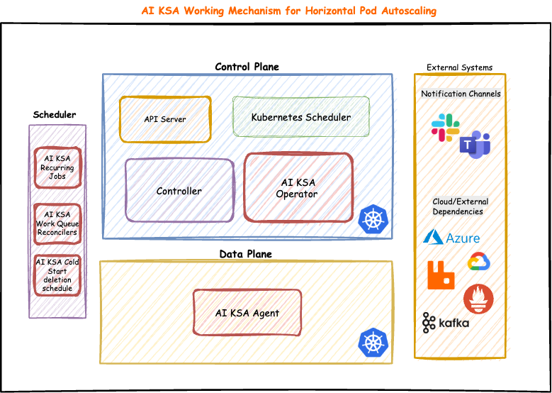
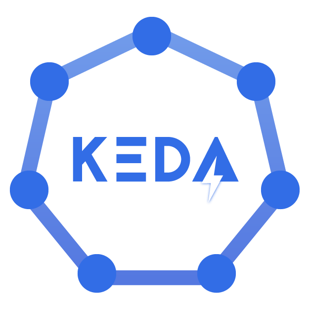
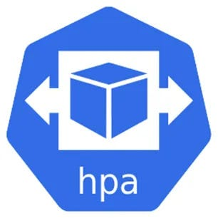

# AI-KSA

AI-KSA is focused on building an AI enabled Kubernetes Scaling Agent to help with Horizantal Pod Autoscaling. 

## Architecture



## Highlights

- [x] Option to abstract metrics logic out of autoscaler and even Kuberentes itself, for overriding base scaling logic of Kubernetes - `desiredReplicas = ceil[currentReplicas * ( currentMetricValue / desiredMetricValue )]`

- [x] Scaling based on CPU, RAM real values as Horizantal Pod Scaling != Unlimited Node Scaling

- [x] Agentic approach with AI based decisions and predictions

- [x] Can be triggered by webhook, labels and by CRDs

- [x] Alertmanager - alerts to scaling via webhook

- [x] External events for scaling via webhook

- [x] Scheduled scaling for recurring events with auto scale down via Kubernetes CronJobs

- [x] Scheduling scaling capabilities for non-recurring events

- [x] On the fly AI based decisions with support for techniques - decision trees, arima, gradient_boosting, rule_based

## CRDs 

- AIHorizontalPodAutoscaler.autoscaling.cortex.me

```yaml
apiVersion: autoscaling.cortex.me/v1 
kind: AIHorizontalPodAutoscaler
metadata:
  name: my-unique-autoscaler 
  namespace: default
spec:
  targetDeploymentName: my-deployment 
  targetDeploymentNamespace: my-namespace 
  targetDeploymentCPUThreshold: 60 

```

- ScheduledScaler.autoscaling.cortex.me

```yaml
apiVersion: autoscaling.cortex.me/v1
kind: ScheduledScaler
metadata:
  name: my-recurring-scaler
  namespace: default
spec:
  targetDeploymentName: my-deployment
  targetDeploymentNamespace: my-namespace
  schedule: "*/1 * * * *" # Every 5 minutes
  duration: "10"            # Duration in minutes
  replicas: 20            # Number of replicas to scale up to
  endReplicas: 10         # Number of replicas to scale down to after the duration
  oneTime: false         # Indicates this is a recurring scaling event
```

## Comparision 

A comparision table is given below, so as to compare with existing best performing autoscalers solving horizantal pod autoscaling in kubernetes.

| Horizantal Pod Autoscaler | Scaling by CPU, RAM usage | CPU, RAM usage by real values | External Events | Metrics | AI enabled | Webhook | Schedule scaling | Custom Enhancements | Easy of Use |
| ----------- | ----------- | ----------- | ----------- | ----------- | ----------- | ----------- | ----------- | ---------- | ---------- |
| KEDA  | :white_check_mark: | :x: | :white_check_mark: (limited) | :white_check_mark: | :x: | :x: | :white_check_mark: | :white_check_mark: (limited) | Medium |
| Kubernetes HPA  | :white_check_mark: | :x: | :x: | :white_check_mark: (beta, needs translation) | :x: | :x: | :x: |  :x: | Very Easy |
| AI-KSA | :x:| :white_check_mark: | :white_check_mark: (Need to extend) | :white_check_mark: | :white_check_mark: (4 AI techniques) | :white_check_mark: | :white_check_mark: | :white_check_mark: | Very Easy |

## Operator Manifests
List of manifests deployed as part of the operator.
```
namespace/operator-system 
customresourcedefinition.apiextensions.k8s.io/aihorizontalpodautoscalers.autoscaling.cortex.me 
customresourcedefinition.apiextensions.k8s.io/scheduledscalers.autoscaling.cortex.me 
serviceaccount/operator-controller-manager 
role.rbac.authorization.k8s.io/operator-leader-election-role 
clusterrole.rbac.authorization.k8s.io/operator-aihorizontalpodautoscaler-editor-role 
clusterrole.rbac.authorization.k8s.io/operator-aihorizontalpodautoscaler-viewer-role 
clusterrole.rbac.authorization.k8s.io/operator-manager-role 
clusterrole.rbac.authorization.k8s.io/operator-metrics-auth-role 
clusterrole.rbac.authorization.k8s.io/operator-metrics-reader 
clusterrole.rbac.authorization.k8s.io/operator-scheduledscaler-editor-role 
clusterrole.rbac.authorization.k8s.io/operator-scheduledscaler-viewer-role 
rolebinding.rbac.authorization.k8s.io/operator-leader-election-rolebinding 
clusterrolebinding.rbac.authorization.k8s.io/operator-manager-rolebinding 
clusterrolebinding.rbac.authorization.k8s.io/operator-metrics-auth-rolebinding 
service/operator-controller-manager-autoscale-trigger 
service/operator-controller-manager-metrics-service 
deployment.apps/operator-controller-manager
deployment.apps/operator-ai-scaling-agent
```

## Using Webhook

Within Cluster
```
curl -X POST http://operator-controller-manager-autoscale-trigger.operator-system.svc.cluster.local:8080/trigger -H "Content-Type: application/json" -d '{
  "namespace": "default",
  "deployment": "somegix",
  "metricType": "overwrite",
  "instructReplicas": 20
}'
```
Outside Cluster
```
 curl -X POST http://x.y.com/trigger -H "Content-Type: application/json" -d '{
  "namespace": "default",
  "deployment": "ai-based",
  "metricType": "overwrite",
  "instructReplicas": 20,
  "callBy": "demo-trigger"
}'
```
```
curl -X POST http://operator-controller-manager-autoscale-trigger.operator-system.svc.cluster.local:8080/trigger -H "Content-Type: application/json" -d '{
  "namespace": "default",
  "deployment": "somegix",
  "metricType": "overwrite",
  "instructReplicas": 20
}'
```
